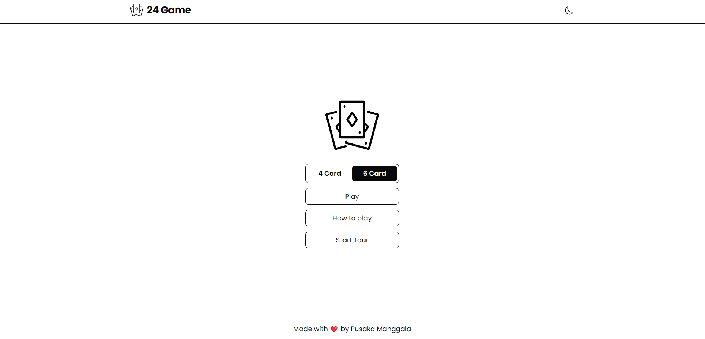

# 24 Games



A math card game where you use four or six cards in your deck. Find the value of 24 in your card combination.
The rules of the game is simple, you have to use matematical calculations based on the value of the cards in your deck. The goal is to get the value to 24.
You can use simple mathematical operations ( x - + ÷ ), but remember to use them according to the rules of mathematical operations.

## Technologies

This App is built with the following technologies:

- [ReactJS](https://reactjs.org/)
- [VITE](https://vitejs.dev/)
- [TailwindCSS](https://tailwindcss.com/)
- [React Joyride](https://react-joyride.com/)
- [React Router](https://reactrouter.com/)
- [React Card Flip](https://www.npmjs.com/package/react-card-flip)

For detailed information on these technologies, please refer to their respective documentation.

## 24 Solver API

Checking and searching for calculation solutions sourced from [24-Game-API](https://github.com/neojarma/24-Game-API)

## Card Deck API
The combination of card decks as well as its information is provided by [Deck of Cards API](https://www.deckofcardsapi.com/). For detailed information on how to use this API, please refer to their documentation.


## Installation

To use this application, you will need [Node.js](https://nodejs.org/) installed on your computer.

1. Clone the repository:
```bash
git clone https://github.com/pusakamanggala/24-game-web-app.git
cd 24-game-web-app
```

2. Install the dependencies:
```bash
npm install
```

3. Start the development server:
```bash
npm run dev
```
>This will start the development server and open the application in your default browser.

## Demo
- [Live Site](https://www.deckofcardsapi.com/)
- [YouTube](https://www.youtube.com/watch?v=pxwHfVRxn7I)
